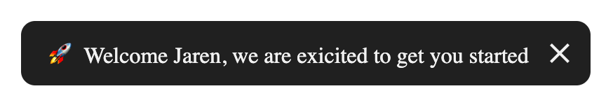
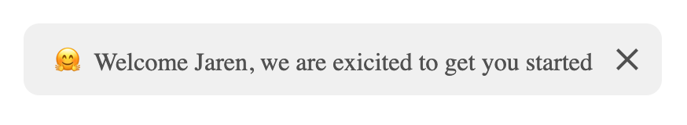
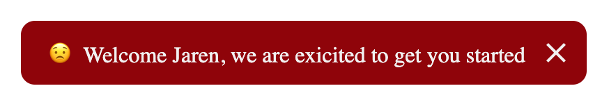

# \<toast-emoji\>

[](https://www.npmjs.com/package/toast-emoji) [](https://www.jsdelivr.com/package/npm/toast-emoji)

Toast emoji is a toast web component, that randomly adds an emoji { 😁 } to your toast message.

### How to Use

```js
import "toast-emoji";
```

Or

```js
import * from "toast-emoji"
```

Or

```html
<script src="https://cdn.jsdelivr.net/npm/toast-emoji@0.0.1/src/index.min.js"></script>
```

### Example

```html
<toast-emoji
  type="sucess"
  message="This is a demo"
  position="bottom-left"
></toast-emoji>
```

#### See demo

- React Demo - https://codesandbox.io/embed/sharp-frost-0qny8?fontsize=14&hidenavigation=1&theme=dark

- Vue Demo - (In progress)

### Attributes

- All attributes are optional

| Attribute | Type    | Description                                                                                                                             | Default          |
| :-------- | :------ | :-------------------------------------------------------------------------------------------------------------------------------------- | :--------------- |
| type      | String  | The type of toast - can be (success, error, warn, light)                                                                                | `""`             |
| message   | String  | The message of toast                                                                                                                    | `Hey there!`     |
| position  | String  | The position of toast on page - can be (top-left, top-right, top-center, left, right, center, bottom-left, bottom-right, bottom-center) | `postion-center` |
| hidden    | Boolean | The hiding status of the toast.                                                                                                         | `false`          |
| timeout   | Integer | The time before toast get hidden in millisecons. when empty - (Always visible until user closes toast).                                 | `""`             |

### Events

- `closed` - event is emitted whenever toast get close by user action or by timeout

```javascript
var toast = document.createElement("toast-emoji");

toast.addEventListener("closed", function() {
  alert();
});
```

### Screenshots

- Dark mode - default
  
- Light mode
  
- Error mode
  
